# 🛒 XÂY DỰNG WEBSITE BÁN VĂN PHÒNG PHẨM

> Báo cáo chuyên đề học phần **Phần Mềm Mã Nguồn Mở**  
> Trường Đại học Điện Lực – Khoa Công Nghệ Thông Tin  
> Giảng viên hướng dẫn: **ThS. Cấn Đức Điệp**

---

## 📌 Tên đề tài

**Xây dựng Website Bán Văn Phòng Phẩm bằng WordPress**

---

## 🌐 Giới thiệu Website / Hệ thống

**ATT Shop** là website thương mại điện tử chuyên cung cấp các sản phẩm văn phòng phẩm phục vụ nhu cầu học tập và làm việc, được xây dựng trên nền tảng mã nguồn mở **WordPress + WooCommerce**.

Website hướng đến các đối tượng khách hàng là học sinh, sinh viên, giáo viên, nhân viên văn phòng và doanh nghiệp, cho phép mua sắm trực tuyến mọi lúc mọi nơi với quy trình đặt hàng đơn giản, nhanh chóng.

### Chức năng chính

**Dành cho khách hàng:**

- Xem danh sách sản phẩm theo danh mục (bút viết, giấy, hồ sơ, dụng cụ học tập,...)
- Tìm kiếm và lọc sản phẩm theo tên, danh mục, khoảng giá
- Xem chi tiết sản phẩm, sản phẩm tương tự, đánh giá sản phẩm
- Thêm vào giỏ hàng, cập nhật số lượng, xóa sản phẩm
- Đặt hàng và thanh toán qua chuyển khoản ngân hàng (VietQR)
- Đăng ký / Đăng nhập tài khoản, quản lý thông tin cá nhân và lịch sử đơn hàng

**Dành cho Admin** (truy cập qua `/wp-admin`)**:**

- Quản lý sản phẩm: thêm, sửa, xóa, ẩn/hiện theo danh mục và loại
- Quản lý đơn hàng: xem, cập nhật trạng thái (chờ xác nhận → đang giao → đã giao / hủy)
- Quản lý khách hàng và người dùng
- Quản lý đánh giá / bình luận (duyệt hoặc xóa)
- Quản lý hóa đơn và thống kê doanh thu

---

## 👥 Danh sách thành viên

| STT | Họ và tên      | MSSV        |
| --- | -------------- | ----------- |
| 1   | Bùi Tuấn Anh   | 23810310038 |
| 2   | Thái Văn Thi   | 23810310037 |
| 3   | Phạm Minh Tuân | 23810310025 |

---

## 📋 Phân công nhiệm vụ

| Thành viên         | Nhiệm vụ                                                                                                                                                      |
| ------------------ | ------------------------------------------------------------------------------------------------------------------------------------------------------------- |
| **Bùi Tuấn Anh**   | Phân tích yêu cầu hệ thống; xây dựng biểu đồ Use Case tổng quát và các biểu đồ phân rã chức năng; thiết kế biểu đồ tuần tự; viết báo cáo chương 1 và chương 2 |
| **Thái Văn Thi**   | Cài đặt và cấu hình WordPress + WooCommerce; cài đặt theme và các plugin cần thiết; thiết kế giao diện trang chủ, cửa hàng, chi tiết sản phẩm                 |
| **Phạm Minh Tuân** | Nhập liệu sản phẩm và danh mục; cấu hình thanh toán VietQR; thiết kế giao diện giỏ hàng, thanh toán, đăng nhập, tài khoản; kiểm thử và viết báo cáo chương 3  |

---

## 🛠️ Công nghệ sử dụng

| Công nghệ                              | Mô tả                                       |
| -------------------------------------- | ------------------------------------------- |
| **WordPress**                          | Nền tảng CMS mã nguồn mở                    |
| **WooCommerce**                        | Plugin thương mại điện tử chính             |
| **WooCommerce PayPal Payments**        | Hỗ trợ thanh toán PayPal                    |
| **VietQR**                             | Thanh toán chuyển khoản ngân hàng qua mã QR |
| **Elementor**                          | Thiết kế giao diện kéo thả (Page Builder)   |
| **Starter Templates**                  | Mẫu giao diện nhanh cho Elementor           |
| **Contact Form 7**                     | Form liên hệ khách hàng                     |
| **SureForms**                          | Tạo form nâng cao                           |
| **SureRank SEO**                       | Tối ưu hóa công cụ tìm kiếm (SEO)           |
| **Variation Swatches for WooCommerce** | Hiển thị biến thể sản phẩm dạng màu sắc/nút |
| **LiteSpeed Cache**                    | Tối ưu tốc độ tải trang                     |
| **WP Reset**                           | Hỗ trợ reset cài đặt khi phát triển         |
| **WPCode Lite**                        | Chèn code tùy chỉnh vào WordPress           |
| **PHP**                                | Ngôn ngữ lập trình server-side              |
| **MySQL**                              | Hệ quản trị cơ sở dữ liệu                   |
| **InfinityFree**                       | Hosting deploy website miễn phí             |

---

## ⚙️ Hướng dẫn cài đặt

### Yêu cầu hệ thống

- PHP >= 7.4 (khuyến nghị PHP 8.x)
- MySQL >= 5.7
- Web server: Apache hoặc Nginx
- RAM tối thiểu: 512MB (khuyến nghị 1GB+)

### Bước 1 – Cài đặt môi trường local

Tải và cài đặt **XAMPP** (hoặc **LocalWP**):

- XAMPP: https://www.apachefriends.org
- LocalWP: https://localwp.com

### Bước 2 – Tải mã nguồn WordPress

```bash
# Tải WordPress mới nhất
https://wordpress.org/download/

# Giải nén vào thư mục htdocs (XAMPP) hoặc thư mục site (LocalWP)
```

### Bước 3 – Tạo cơ sở dữ liệu

1. Mở **phpMyAdmin** tại `http://localhost/ATTSHOP/phpmyadmin`
2. Tạo database mới, ví dụ: `attshop_db`
3. Chọn charset: `utf8mb4_unicode_ci`

### Bước 4 – Cấu hình WordPress

1. Truy cập `http://localhost/ATTSHOP` trên trình duyệt
2. Làm theo hướng dẫn cài đặt WordPress
3. Điền thông tin kết nối database đã tạo ở Bước 3

### Bước 5 – Cài đặt Plugin & Theme

Vào **WordPress Admin → Plugins → Add New**, tìm kiếm và cài đặt:

- `WooCommerce` – thương mại điện tử
- `Elementor` – thiết kế giao diện
- `VietQR` – thanh toán chuyển khoản
- `SureRank SEO` – tối ưu SEO
- `LiteSpeed Cache` – tối ưu tốc độ
- `Contact Form 7` – form liên hệ
- `WPCode Lite` – tùy chỉnh code

---

## ▶️ Hướng dẫn chạy project

### Chạy trên môi trường local (XAMPP)

```
1. Mở XAMPP Control Panel
2. Start Apache và MySQL
3. Truy cập http://localhost/ATTSHOP
4. Trang chủ website hiển thị → hoạt động bình thường
```

### Truy cập trang quản trị Admin

```
URL: http://localhost/ATTSHOP/wp-admin
```

### Các trang chính của website

| Trang          | Đường dẫn     |
| -------------- | ------------- |
| Trang chủ      | `/`           |
| Cửa hàng       | `/store`      |
| Giỏ hàng       | `/cart`       |
| Thanh toán     | `/checkout`   |
| Tài khoản      | `/my-account` |
| Liên hệ        | `/8461-2/`    |
| Trang quản trị | `/wp-admin`   |

---

## 🖼️ Hình ảnh minh họa hệ thống

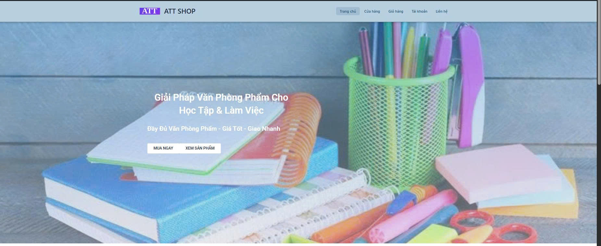

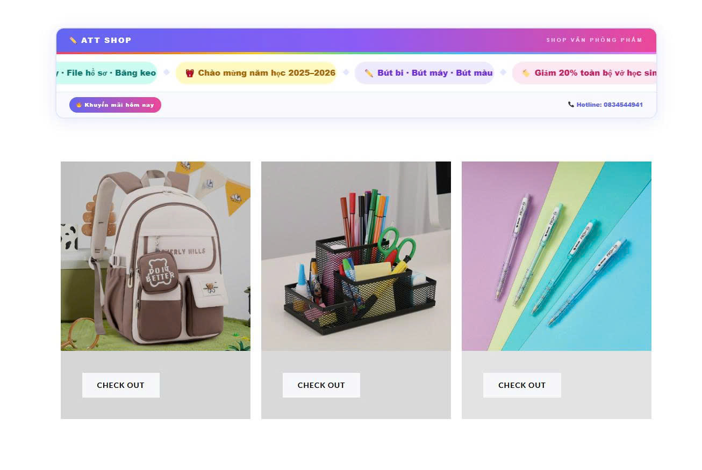

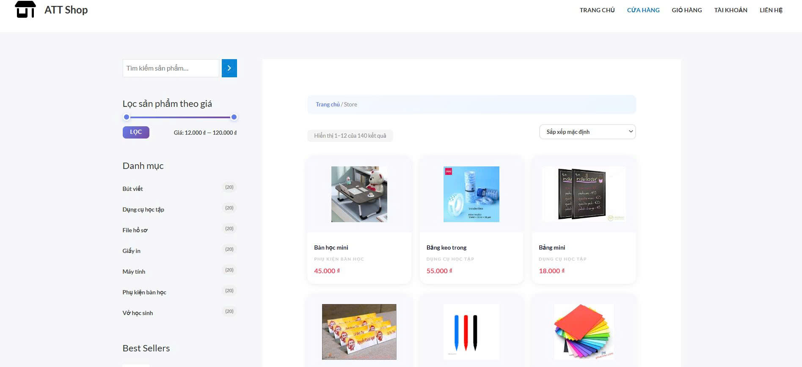

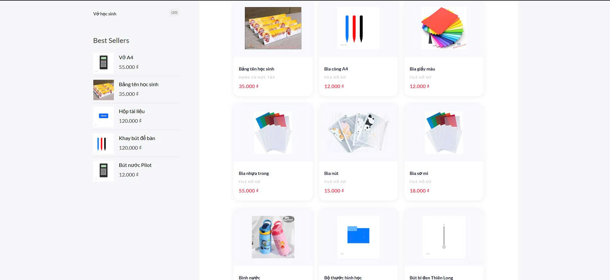

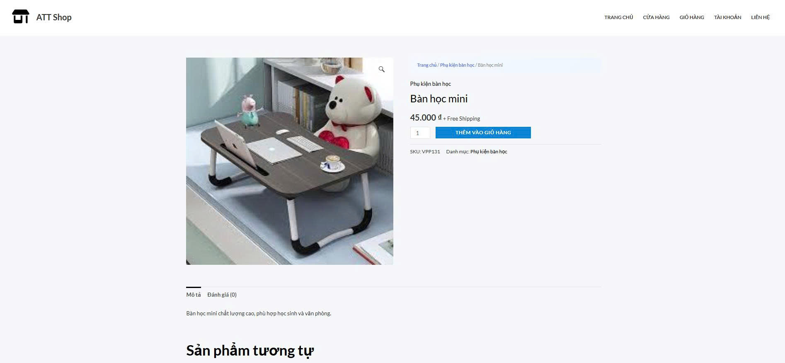

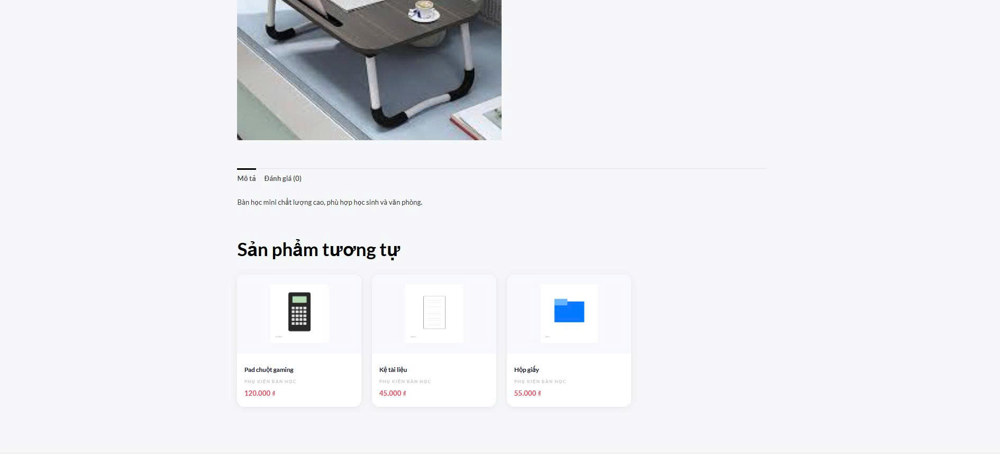

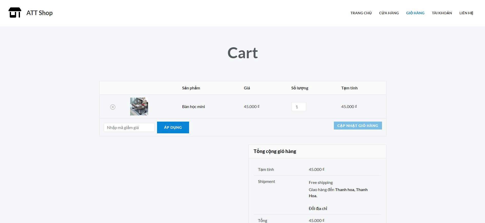

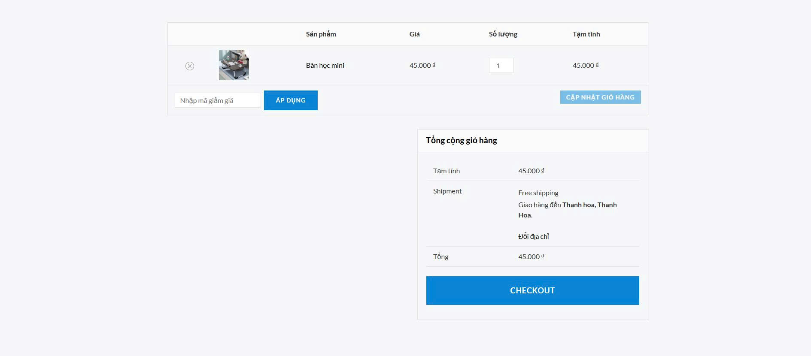

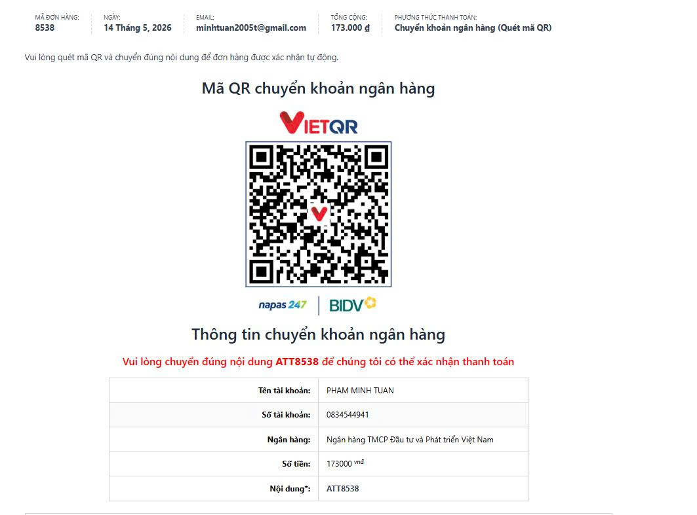

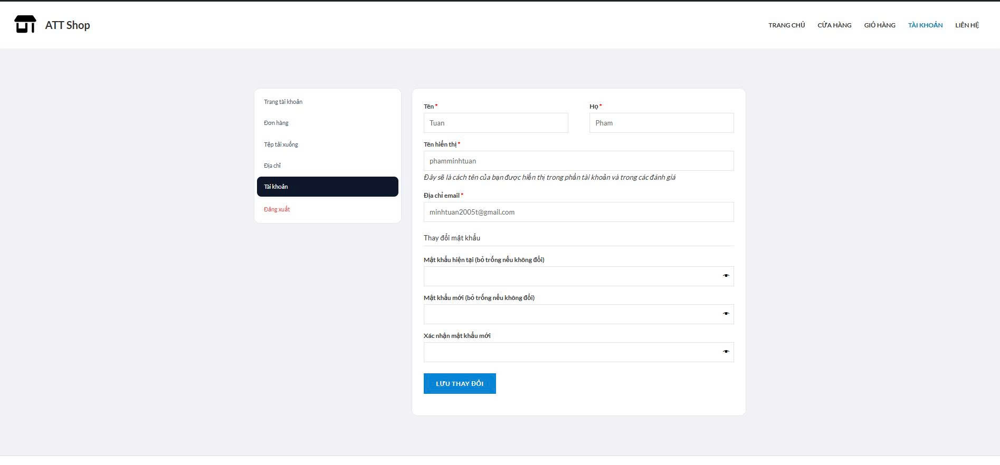

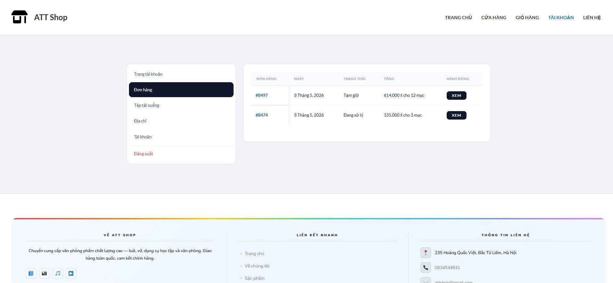


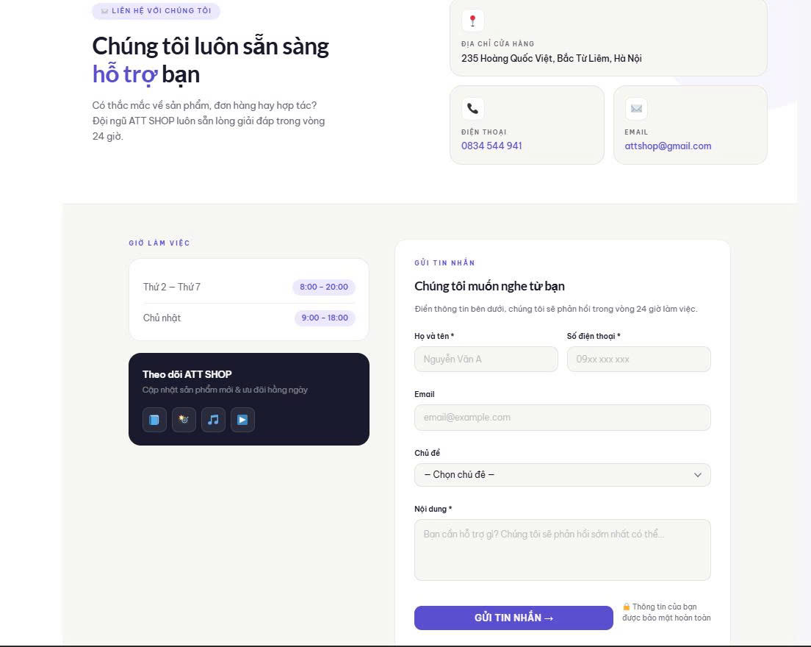

---

## 🎬 Link video demo

> _(Bạn tự thêm link video vào đây)_

---

## 🌍 Link online đã deploy

🔗 https://attshop.infinityfreeapp.com

---

## 🔐 Tài khoản demo

| Vai trò    | Tài khoản      | Mật khẩu   |
| ---------- | -------------- | ---------- |
| Khách hàng | `phamminhtuan` | `19032005` |

---

## 📚 Tài liệu tham khảo

- WordPress Official Docs – https://wordpress.org
- WooCommerce Documentation – https://woocommerce.com/documentation
- WordPress Tutorials – https://udemy.com
- Thachpham Blog – https://thachpham.com
- Tổng quan TMĐT Việt Nam – https://idea.gov.vn

---

<div align="center">
  <sub>© 2026 ATT Shop – Trường Đại học Điện Lực | Khoa Công Nghệ Thông Tin</sub>
</div>
